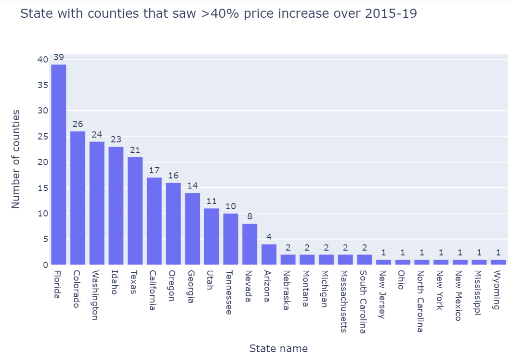
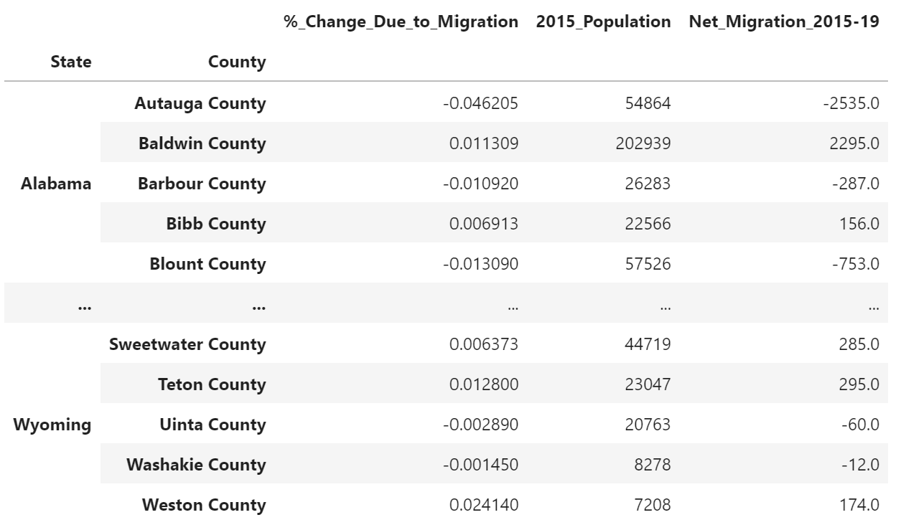

# Impact of Migration on Housing Prices
## Selected Topic
Purposes of the project is to gauge the impact of in-country population migration in the U.S. on house prices. In addition, we will identify population migration patterns in the U.S. using various visualizations. We will also look for factors other than migration that could impact housing prices in the U.S. General hypothesis is that population growth drives up real estate prices (and vice versa). 

### Underlying reason
We think population migration has wide ranging implications for the U.S population including economic, political, demographic and societal impact. Population migration could impact economic growth, cost of living, real estate prices, transportation, congressional redistricting, government budgets, demographic makeup, etc. In this analysis, we will show population migration patterns in the U.S. and how that has impacted housing prices. We will also look for factors other than migration that could impact housing prices in the U.S. 

### Description of the source of data

- The American Community Survey (ACS) done by the U.S. Census provides data on changes taking place in population and housing in the U.S. We are using county to county migration data from ACS during 2015-19. [County-to-County Migration Flows: 2015-2019 ACS](https://www.census.gov/data/tables/2019/demo/geographic-mobility/county-to-county-migration-2015-2019.html). 
	- The raw data is in this [text file](Resources/Net_Gross_US.txt)
- Estimated total population by county over 2010-19 from the US Census: [Total population by county 2010-19](https://www2.census.gov/programs-surveys/popest/datasets/2010-2019/counties/totals/co-est2019-alldata.csv)
	- The raw data is in this [csv file](Resources/County_population_totals_2010_2019_co-est2019-alldata.csv)
- Federal Housing Finance Agency (FHFA) House Price Index (HPI) is a broad measure of the movement of single-family house prices. The FHFA HPI is a weighted, repeat-sales index, meaning that it measures average price changes in repeat sales or refinancings on the same properties. FHFA provides HPI for all counties in the U.S. [FHFA HPI data from US Federal Reserve](https://geofred.stlouisfed.org/map/?th=ylgn&cc=5&rc=false&im=fractile&sb&lng=-100.239&lat=41.558&zm=5&sl&sv&sti=942&rt=county&at=Not%20Seasonally%20Adjusted,%20Annual,%20Index%202000%3D100,%20no_period_desc&fq=Annual&dt=2020-01-01&am=Average&un=lin) 
	- The raw data is in this [Excel file](Resources/GeoFRED_All-Transactions_House_Price_Index_by_County_Index.xlsx)
- Interest rate data: [30-Year Fixed Rate Mortgage Average in the United States](https://fred.stlouisfed.org/series/MORTGAGE30US)
	- The raw data is in this [CSV file](Resources/MORTGAGE30US.csv)
- "All-Transactions House Price Index for the United States" from Federal Housing Finance Agency (FHFA) is a broad measure of the movement of single-family house prices in the US. [All-Transactions House Price Index for the United States](https://fred.stlouisfed.org/series/USSTHPI)
	- 	The raw data is in this [CSV file](Resources/USSTHPI.csv)

### Questions we hope to answer with the data
- What areas are people leaving and where are they going?
- What is the scale of migration over time?
- Which counties saw highest and lowest % increase and decrease in migration? 
- When people move, are they staying in their current state or go to a different state?
- What is the impact of population change on residential real estate prices?
- How could you use population migration data and real estate prices to make home buying decision or planning your next move?
- What other factors drive real estate price (e.g. interest rates, income/wealth, residential construction activity)?
- What are some other implications of population migration (e.g. overall cost of living, congressional redistricting)?


## Data Exploration
We mentioned above in the data description section above, we had data in various format. We did Data Exploration in Pandas using Pandas, NumPy and Mitosheet.

1. **House Price Index** Data from [House Price Index for all counties (Excel file)](https://github.com/hishamdewan/Migration_and_Housing/blob/main/Resources/GeoFRED_All-Transactions_House_Price_Index_by_County_Index.xlsx) was transformed as below and output file in CSV format [Cleaned data - House Price Index for all counties](https://github.com/hishamdewan/Migration_and_Housing/blob/main/Resources/house_price_df.csv) was generated.

   - Removed unnecessary columns for house prices between 1975-1999,
   - Created columns for population change and real estate price change, and
   - Exported a CSV file with cleaned house price data.

   Code base [Jupyter Notebook - House Price Index Data Clean Up](https://github.com/hishamdewan/Migration_and_Housing/blob/main/House_Price.ipynb).

The following is screenshot show a list of states that had counties that saw >40% housing price (i.e. HPI) increase over 2015-19.




2. **Migration** Data from [County-to-County Migration Flows 2015-2019 ACS data (Text file)](https://github.com/hishamdewan/Migration_and_Housing/blob/main/Resources/Net_Gross_US.txt) was transformed as below and output file in CSV format [Cleaned data - County Level Migration as % of total population](https://github.com/hishamdewan/Migration_and_Housing/blob/main/Resources/county_level_migration_15-19.csv) was generated.
    
   - Removed unnecessary columns in the migration data,
   - Renamed columns to user friendly names,
   - Reordered the columns,
   - Cleaned values in column "State Name of Geography A",
   - Created pivot table showing population change (i.e. number of people migrating and as % of total population), and
   - Created two CSV files: one for ML model and the other to store in the database.
  
   Code base [Jupyter Notebook - Migration Flows Data Clean Up](https://github.com/hishamdewan/Migration_and_Housing/blob/main/population_change.ipynb).

The screenshot of a pivot table shows population change by state and county:


    

3. **Net Migration** Data from [County-to-County Migration Flows 2015-2019 Ins-Outs-Nets-Gross (Excel file)](\Resources\cleaned-county-to-county-2015-2019-ins-outs-nets-gross.xlsx) was transformed as below and output file in CSV format [Cleaned data - County Level Migration by number of people and source county](https://github.com/hishamdewan/Migration_and_Housing/blob/main/Resources/cleaned-county-to-county-2015-2019-ins-outs-nets-gross.csv) was generated.
  
	  - Removed unnecessary columns in the migration data,
	  - Renamed and Reordered the columns to user friendly names, and
	  - Generated new file in csv format.
      
   Code base [Jupyter Notebook - Migration Flows by County](https://github.com/hishamdewan/Migration_and_Housing/blob/main/cleaning_excel_file.ipynb).


4. **Mortgage Rates** Data source [30 year Mortgage Rates](https://github.com/hishamdewan/Migration_and_Housing/blob/main/Resources/MORTGAGE30US.csv) was cleaned and merged with [House Price Index](https://github.com/hishamdewan/Migration_and_Housing/blob/main/Resources/USSTHPI.csv) were transformed and merged before using in the Machine Learning Model 2 - HPI vs Mortgage Rate
	- Convert data from both files to "Quarterly" timeline to use in the model.
	
   Code base [Jupyter Notebook - Mortgage Rates](https://github.com/Bhargavi-ng/Migration_and_Housing/blob/main/linear_regression_HPI_vs_30MORTGAGE.ipynb).

5. **Current and Previous Residence** Data from [county-to-county-2015-2019-previous-residence-sort (Excel file)](/Resources/county-to-county-2015-2019-current-residence-sort.xlsx) was transformed as below and output file in CSV format [cleaned_2015_2019_current_previous_residence_data](Resources/cleaned_2015_2019_current_previous_residence_data.csv) was generated.
	  -  Cleaned data provided for each state in separate worksheet in the excel by iterating and doing the below
	     -  Condense four header rows into one header and remove the extra rows for all the sheets in the excel,
	     -  Remove unwanted columns, 
	     -  Remove footer notes rows in each sheet,
	     -  fill empty cells with '0', and 
	     -  replacing '-' for Foreign movers with 'NA', 
	  - Combined data from all states,
	  - Added additional rows and filled values by joining 2 columns, and
	  - Generated csv file.
	Code base [Jupyter Notebook - Current and Previous Residence](https://github.com/Bhargavi-ng/Migration_and_Housing/blob/main/current_residence_county_CleanUp.ipynb).


## Data Analysis / Machine Learning Models
We are using two machine learning model for this analysis.

### Model 1: House price and Migration
A linear regression model that regresses percentage house price changes for counties in the US over 2015-19 against population change in those countries during the same period. The linear regression model tests the null hypothesis that population growth drives up real estate prices. The ML model takes data from the AWS Relational database. We will assess the quality of the model using R squared and other metrics. 

***Findings:***

The model does not support our null hypothesis, as in the migration of population within U.S. did not drive up the Real Estate Prices as shown in the below screenshot. The R squared value for this model is 2.13% meaning this model explains only 2% of the Total Price Increase in the Housing Real Estate. Thus, based on this model our Null hypothesis is rejected.


***Data used for the model:*** 

1. **House Price Index** Data - [Cleaned data - House Price Index for all counties](https://github.com/hishamdewan/Migration_and_Housing/blob/main/Resources/house_price_df.csv) was generated.

2. **Migration** Data - [Cleaned data - County Level Migration as % of total population](https://github.com/hishamdewan/Migration_and_Housing/blob/main/Resources/county_level_migration_15-19.csv)
  
3. **Net Migration** [Cleaned data - County Level Migration by number of people and source county](https://github.com/hishamdewan/Migration_and_Housing/blob/main/Resources/cleaned-county-to-county-2015-2019-ins-outs-nets-gross.csv).
      
***Database Integration***

We used AWS Relational Database to store the data needed for this model. A connection was established using Postgres and SQLAlchemy to pull the data needed to run the model as shown in the below screenshot. You can find ERD and more details about the implementation below in the Database section.


***Training and Testing sets:***

The dataset was split into training and testing sets for the model using SKlearn as shown below.


***Model Quality:***

This model has a mean squared error value of nearly zero (0.02), which represents a perfect model. We can say that the quality of the model is very good. 


Code base [Jupyter Notebook - Linear Regression model regressing house price and migration](https://github.com/hishamdewan/Migration_and_Housing/blob/main/linear_regression_HPI_vs_pop.ipynb).


### **Model 2: House Price Index and 30 year Fixed Mortagage Rates**
We used a second linear regression model that will regress "**All-Transactions House Price Index for the United States**" on "**30-Year Fixed Rate Mortgage Average in the United States**" between 2000-2021. This model tests the hypothesis that falling interest rates drives up housing prices in the U.S. We assessed the quality of the model using R squared and other metrics. 

***Findings:***

The model supports our hypothesis that falling interest rate drives up the housing prices in U.S. as shown below. This model has a R squared value of 68.5% meaning that falling interest rates explains 68.5% of the Total Increase in House Prices. There are other factors influencing the remaining 31.5% of the Total Increase in House prices.


***Data used:***

Data sources [30 year Mortgage Rates](https://github.com/hishamdewan/Migration_and_Housing/blob/main/Resources/MORTGAGE30US.csv) and [House Price Index](https://github.com/hishamdewan/Migration_and_Housing/blob/main/Resources/USSTHPI.csv) were transformed and merged before using in the model.

***Training and Testing sets:***

We used SKlearn to split the above processed data into training and testing sets as shown below screenshot.


***Model Quality:***

This model has a mean squared error value of 3.64. A perfect model will have the value "0". 3.64 is relatively small and thus, we can conclude the quality of the model is relatively good. 


Code base [Jupyter Notebook - Linear Regression model regressing House price and Mortgage rate](https://github.com/hishamdewan/Migration_and_Housing/blob/main/linear_regression_HPI_vs_30MORTGAGE.ipynb)

#### Neural Network Model
We tried to create a neural network model using House Price Index and 30 year fixed Mortgage data. But, as we did not have sufficient quantity of data the model did not yield good results.

Code base [Jupyter Notebook - Neural Network Model House price and Mortgage rate](https://github.com/hishamdewan/Migration_and_Housing/blob/main/neural_network_HPI_vs_30MORTGAGE.ipynb)


## Database
PostgreSQL database in AWS RDS is used to store data used for this project. The static data from FHFA HPI for each county and population migration by county were data preprocessing and loaded into Postgres AWS database in AWS RDS. Those two data sources with merged in AWS using SQL and prepared to be consumed for various Machine Learning models.

The following is a screenshot of the entity relations diagram (ERD) we used for the analysis:


For the security purposes, sensitive information needed to connect to AWS RDS is saved on config.py file and called in following files to upload and download data.
* Migration_data_upload.ipynb
* loading_house_price_data_to_RDS.ipynb
* linear_regression_HPI_vs_pop.ipynb

The following is a screenshot of MIGRATIONS_IN_OUTS_NETS_GROSS data table that stores processed
County-to-County Migration Flows 2015-2019 ACS data in the database:


The following is a screenshot of HOUSE_PRICE data table that stores processed FHFA HPI for each county in the database:


Below is the SQL used to join MIGRATIONS_IN_OUTS_NETS_GROSS and HOUSE_PRICE.
```
SELECT
	 B.state_name_of_geography_a,
    B.county_name_of_geography_a,
    B.state_and_county_of_geography_a,
    A.REGION_CODE AS REGION_CODE_geography_a,
    B.state_us_island_area_foreign_region_of_geography_b,
    B.county_name_of_geography_b,
    B.state_and_county_of_geography_b,
    B.flow_from_geography_b_to_geography_a,
    B.counterflow_from_geography_a_to_geography_b, 
    B.net_migration_from_geography_b_to_geography_a1,
    B.gross_migration_between_geography_a_and_geography_b1,
    A."2000" ,A."2001" ,A."2002" ,A."2003" ,A."2004" ,A."2005",
    A."2006" ,A."2007" ,A."2008" ,A."2009",A."2010" ,A."2011",
    A."2012",A."2013" ,A."2014" ,A."2015" ,A."2016",A."2017",
    A."2018",A."2019" ,A."2020",
    A.percent_price_change_2015_19
INTO house_price_migration_in_out
FROM house_price A
INNER JOIN migration_in_outs_nets_gross B
	ON A.state_and_county = B.state_and_county_of_geography_a;
```
The data from house_price_migration_in_out is utilized to run Linear Regression on house price and migration.


## Dashboard
We are using Tableau to create the graphs and charts necessary for visualization. The "Dashboard" and "Story" features of the Tableau will help us with story telling when the time comes for the presentation.
Here is the link to our [Tableau Workbook](https://public.tableau.com/app/profile/hisham.dewan/viz/Migration_flows_Book2/Story-MigrationHousing)

The interactive elements we used for creation of graphs and charts are
- Population migration within U.S.A
  - County level
  - State level
- House Price Index
- Population growth
- Mortgage Rate of Interest


### Presentation
The outline for the presentation has been created as part of Segement2 Deliverable. Here is the [link](https://docs.google.com/presentation/d/1ZMPZ4rW7OaxI3ja43FWr-0ZHVNi6gMHT/edit#slide=id.p1)


## Recommendations for Future Analysis
TBD


## Communication Protocol
The group will communicate and keep each other posted using Slack channel for Group 3 and Zoom. 

- Link to [Group 3's Slack Channel](https://ucbvirtdatapt-puq6469.slack.com/archives/C02RWJSSP53)
- Link to Zoom is in the Slack channel. We will meet during class hours on Tuesday and Thursday 7pm PST.
- Team members will work on 3 separate GitHub branches and inform the group of commits and progress of their work.
- Once all members have completed their weekly task, the person with the "Square Role" (defined below) will merge the branches.  

## Tech Used and Team Roles
- Data Clean up: Jupyter Notebook, Python, Pandas Library, Mito, SQLAlchemy
- Database: PostgresSQL, Amazon Relational Database Service
- Data Visualization: Tableau

### Team Members
1. Hisham Dewan
2. Shirley Liu
3. Zhen Fung
4. Bhargavi Nagarajappa
5. Teruki Ito
6. Merina Kansakar

### Team Roles for First Segement of the Project:
- Square Role (GitHub): Hisham Dewan
- Triangle Role (Machine Learning): Teruki Ito, Zhen Fung
- Circle Role (Database): Shirley Liu, Merina Kansakar
- X Role (Technology & Visualization): Bhargavi Nagarajappa

### Team Roles for Second Segement of the Project:
- Square Role : Bhargavi Nagarajappa
- Triangle Role : Shirley Liu, Hisham Dewan
- Circle Role : Teruki Ito, Merina Kansakar
- X Role : Zhen Fung, Hisham Dewan

### Team Roles for Third Segement of the Project:
- Square Role : Shirley Liu
- Triangle Role : Hisham Dewan
- Circle Role : Zhen Fung, Bhargavi Nagarajappa
- X Role : Teruki Ito, Merina Kansakar
